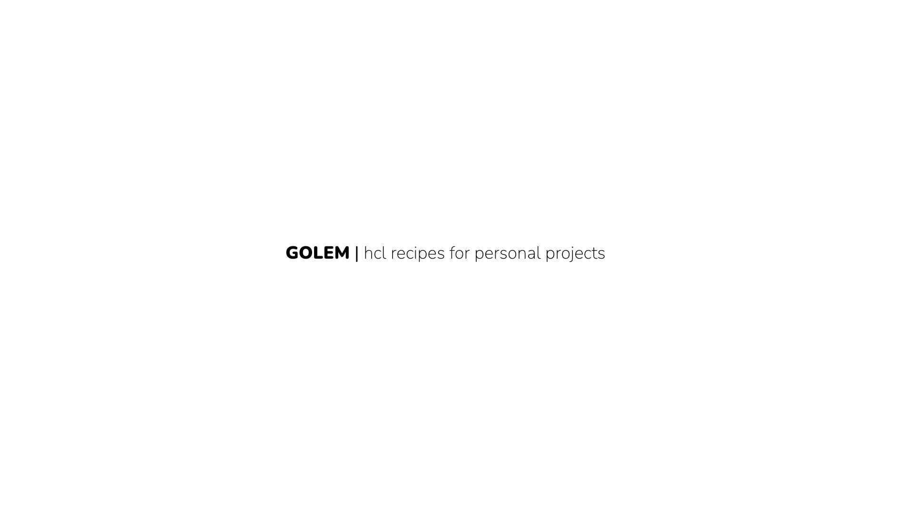

GOLEM is a tiny go binary that helps you manage your personal projects with [Hashicorp HCL](https://github.com/hashicorp/hcl) based recipes.

# About
Personal projects are unique. I've run quite a few of them over the last 20 years, and the one big problem with them is remembering how to deploy them when you haven't touched them for six months. I've gone from running them as binaries with Makefiles on tiny DigitalOcean servers to running docker containers manually to running them on a little k8s cluster (which felt like killing mosquitos with automatic machine guns). Finally, I settled on running them on a tiny [Nomad](https://www.nomadproject.io/) cluster (which worked beautifully).

[Nomad](https://www.nomadproject.io/) and [Terraform](https://www.terraform.io/) significantly simplify how you run servers and services (and tools like [hashi-up](https://github.com/jsiebens/hashi-up), which facilitate setting up Nomad); however, you are back to Makefiles and shell scripts whenever you need to handle older servers Terraform can't control or aren't migrated to Nomad.

Hence, I came up with Golem one weekend. The idea was to build something like a [Terraform Provisioner](https://www.terraform.io/language/resources/provisioners/syntax) with remote-exec that you can use on any machine that you can access via SSH.

Lastly, this is not meant for production. As the Terraform documentation constantly reminds us - [Provisioners are the last resort](https://www.terraform.io/language/resources/provisioners/syntax). If you plan anything but personal projects to production, I suggest switching entirely to Packer, Terraform and Nomad, or Kubernetes.

# Getting Started
The only way to get Golem running on your machine today is to install golang on your device and then run go install
```bash
$ brew install go
$ go install github.com/sudhanshuraheja/golem@latest
```

Golem expects a configuration file at `~/.golem/golem.hcl`. You can set it up by running
```bash
$ golem
init | conf file created at /Users/your-username/.golem/golem.hcl
Here are the recipes that you can use with '$ golem recipe-name'

Name     Match       Artifacts  Commands
servers  local only  0          0

You can add more recipes to '~/.golem/golem.hcl'
```

You can make editing the config easier by adding a shortcut to your .zshrc or .bashrc to open the config file in VSCode
```bash
$ echo 'alias glm="code /Users/sudhanshuraheja/.golem/golem.hcl"' >> ~/.zshrc
$ source ~/.zshrc
$ glm
```

# Adding servers
The first step is to add servers to your config, so that you can take actions on them
```bash
server "thebatch" {
    hostname = "thebatch.local"
    public_ip = "173.168.86.17"
    private_ip = "192.168.1.55"
    user = "sudhanshu"
    port = 22
    tags = ["redis", "vpc-private"]
}
```
Before connecting via SSH, Golem will check if the public_ip exists. If it doesn't, it will connect to the hostname.

You can also automatically connect all your servers from Terraform to Golem.
```bash
server_provider "terraform" {
    config = [
        "full-path-to/terraform.tfstate",
        "another-full-path-to/terraform.tfstate"
    ]
    user = "root"
    port = 22
}
```
Golem only looks for Terraform resources of type `digitalocean_droplet` to add to the server list. You can include any number of tfstate files.

To view all connected Golem servers, you can run the servers recipe
```bash
$ golem servers
Name      Public IP        Private IP      User       Port  Tags                                                Hostname
thebatch                   192.168.86.173  sudhanshu  22    local                                               thebatch.local
postgres  128.199.226.65   10.104.16.8     root       22    postgres, vpc-private
...
```

# Adding Recipes
Here's a sample recipe that uploads a file to the remote server and checks if it exists
```bash
recipe "test-exec" {
    type = "exec"
    match {
        attribute = "name"
        operator = "like"
        value = "skye-c"
    }
    artifact {
        source = "LICENSE"
        destination = "LICENSE"
    }
    commands = [
        "ls -la L*"
    ]
}
```


You can match servers using the `attribute`, `operator` and `value` fields.
Int-based attributes can use `=`, `!=`, `>`, `>=`, `<`, `<=` operators
String-based attributes can use `=`, `!=`, `like` operators
Array-based attributes can use `contains`, `not-contains` operators

Artifacts upload files from a local source to a remote destination. You can use both relative and absolute paths. You can add multiple `artifact` blocks in the recipe.

Here's an example of updating the nomad config and restarting servers
```bash
recipe "nomad-server-config-update" {
    type = "exec"
    match {
        attribute = "tags"
        operator = "contains"
        value = "nomad-server"
    }
    artifact {
        source = "configs/nomad_server.hcl"
        destination = "/etc/nomad.d/nomad.hcl"
    }
    artifact {
        source = "certs/nomad-ca.pem"
        destination = "/etc/nomad.d/nomad-ca.pem"
    }
    artifact {
        source = "certs/server.pem"
        destination = "/etc/nomad.d/server.pem"
    }
    artifact {
        source = "certs/server-key.pem"
        destination = "/etc/nomad.d/server-key.pem"
    }
    commands = [
        "chown nomad:nomad /etc/nomad.d/server-key.pem",
        "systemctl daemon-reload",
        "systemctl stop nomad",
        "systemctl start nomad",
    ]
}
```

After adding recipes, you can check which recipes exist in Golem's configuration by running the `golem list` recipe
```bash
$ golem list
Name                        Match                       Artifacts  Commands
apt-update                  tags not-contains local     0          1
tail-syslog                 tags contains nomad         0          1
test-exec                   name like skye-c            1          1
nomad-server-config-update  tags contains nomad-server  4          4
nomad-client-config-update  tags contains nomad-client  4          6
apply-security-patch        name = skye-s3              0          3
...
servers                     local only                  0          0
```

# SSH and SFTP
Golem uses one goroutine per server. The goroutine creates an initial SSH connection to the server and uses it to upload artifacts to the server and run each command. It makes a new session for each command. Artifacts are uploaded before running commands.

The number of goroutines is capped to 4 by default and can be changed by setting `max_parallel_processes = 16` or any number you like. This is a global setting.

# Logging
Logging is set to `WARN` by default. You can change it by setting the config's global `loglevel` setting.
```bash
loglevel = "INFO"
```

When the log level is set to `WARN`, you will not see the output of the commands being run on the server or the goroutines logs. You will only see an update when a command runs successfully or fails and if the artifact uploads or fails. 