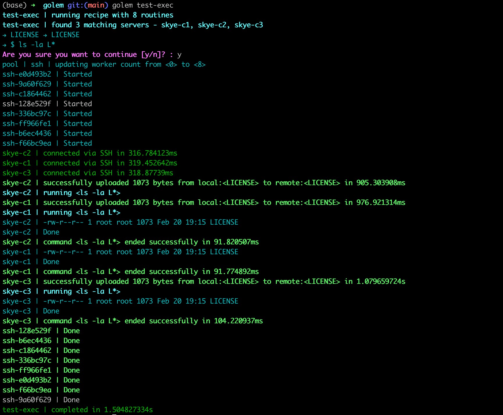

<div align="center">

# GOLEM
Golem is a deployment tool that lets you upload artifacts and execute<br>commands in parallel on local or multiple servers via SSH using human readable [Hashicorp HCL] recipes

[Getting Started] •
[Adding servers] •
[Adding Recipes] •
[SSH and SFTP] •
[Suggest a feature?]

[](https://forthebadge.com)
[](https://forthebadge.com)

</div>

# Why a new deployment tool?
Golem is a deployment tool built with go that runs over SSH, manages configs and recipes with [Hashicorp HCL] files, and lets you upload artifacts and execute commands in parallel on local or multiple servers.

If like me, you have developed a distinct hatred for YAML based configs like the ones you need to use for Ansible,  Kubernetes and the like, you're going to enjoy building the recipes in a very human readable [Hashicorp HCL] based format. Just like you would for [Nomad], [Terraform] or [Consul]

The core idea behing Golem was to build something like a [Terraform Provisioner] (they are the last resort) with remote-exec that you can use on any machine that you can access via SSH.

# Getting Started
The best way to get Golem running on your machine today is to install golang on your device and then run go install
```bash
$ brew install go
$ go install github.com/sudhanshuraheja/golem@latest
```

Golem expects a configuration file at `~/.golem/config.golem.hcl` or at `./config.golem.hcl`. You can also set it up at both places. Golem can read and merge multiple `*.golem.hcl` files in `~/.golem/` and `./`. You can set it up by running
```bash
$ golem
init | conf file created at /Users/your-username/.golem/config.golem.hcl
Here are the recipes that you can use with '$ golem recipe-name'

Name     Match       Artifacts  Commands
servers  local only  0          0

You can add more recipes to '~/.golem/config.golem.hcl'
```

You can make editing the config easier by adding a shortcut to your .zshrc or .bashrc to open the config file in VSCode
```bash
$ echo 'alias glm="code /Users/sudhanshuraheja/.golem/config.golem.hcl"' >> ~/.zshrc
$ source ~/.zshrc
$ glm
```

# Adding servers
The first step is to add servers to your config, so that you can take actions on them
```bash
server "thebatch" {
    hostname = "thebatch.local"
    public_ip = "173.168.86.17"
    private_ip = "192.168.1.55"
    user = "sudhanshu"
    port = 22
    tags = ["redis", "vpc-private"]
}
```
Before connecting via SSH, Golem will check if the public_ip exists. If it doesn't, it will connect to the hostname.

You can also automatically connect all your servers from Terraform to Golem.
```bash
server_provider "terraform" {
    config = [
        "full-path-to/terraform.tfstate",
        "another-full-path-to/terraform.tfstate"
    ]
    user = "root"
    port = 22
}
```
Golem only looks for Terraform resources of type `digitalocean_droplet` to add to the server list. You can include any number of tfstate files.

To view all connected Golem servers, you can run the servers recipe
```bash
$ golem servers
Name      Public IP        Private IP      User       Port  Tags                                                Hostname
thebatch                   192.168.86.173  sudhanshu  22    local                                               thebatch.local
postgres  128.199.226.65   10.104.16.8     root       22    postgres, vpc-private
...
```

# Adding Recipes
Here's a sample recipe that uploads a file to the remote server and checks if it exists
```bash
recipe "test-exec" {
    type = "remote-exec"
    match {
        attribute = "name"
        operator = "like"
        value = "skye-c"
    }
    artifact {
        source = "LICENSE"
        destination = "LICENSE"
    }
    commands = [
        "ls -la L*"
    ]
}
```

Here's one that runs commands locally
```bash
recipe "ls-la" {
    type = "local-exec"
    commands = [
        "ls -la",
        "nomad version",
        "consul version",
    ]
}
```



You can match servers using the `attribute`, `operator` and `value` fields.
Int-based attributes can use `=`, `!=`, `>`, `>=`, `<`, `<=` operators
String-based attributes can use `=`, `!=`, `like` operators
Array-based attributes can use `contains`, `not-contains` operators

Artifacts upload files from a local source to a remote destination. You can use both relative and absolute paths. You can add multiple `artifact` blocks in the recipe.

Here's an example of updating the nomad config and restarting servers
```bash
recipe "nomad-server-config-update" {
    type = "remote-exec"
    match {
        attribute = "tags"
        operator = "contains"
        value = "nomad-server"
    }
    artifact {
        source = "configs/nomad_server.hcl"
        destination = "/etc/nomad.d/nomad.hcl"
    }
    artifact {
        source = "certs/nomad-ca.pem"
        destination = "/etc/nomad.d/nomad-ca.pem"
    }
    artifact {
        source = "certs/server.pem"
        destination = "/etc/nomad.d/server.pem"
    }
    artifact {
        source = "certs/server-key.pem"
        destination = "/etc/nomad.d/server-key.pem"
    }
    commands = [
        "chown nomad:nomad /etc/nomad.d/server-key.pem",
        "systemctl daemon-reload",
        "systemctl stop nomad",
        "systemctl start nomad",
    ]
}
```

After adding recipes, you can check which recipes exist in Golem's configuration by running the `golem list` recipe
```bash
$ golem list
Name                        Match                       Artifacts  Commands
apt-update                  tags not-contains local     0          1
tail-syslog                 tags contains nomad         0          1
test-exec                   name like skye-c            1          1
nomad-server-config-update  tags contains nomad-server  4          4
nomad-client-config-update  tags contains nomad-client  4          6
apply-security-patch        name = skye-s3              0          3
...
servers                     local only                  0          0
```

# SSH and SFTP
Golem uses one goroutine per server. The goroutine creates an initial SSH connection to the server and uses it to upload artifacts to the server and run each command. It makes a new session for each command. Artifacts are uploaded before running commands.

The number of goroutines is capped to 4 by default and can be changed by setting `max_parallel_processes = 16` or any number you like. This is a global setting.

# Logging
Logging is set to `WARN` by default. You can change it by setting the config's global `loglevel` setting.
```bash
loglevel = "INFO"
```

When the log level is set to `WARN`, you will not see the output of the commands being run on the server or the goroutines logs. You will only see an update when a command runs successfully or fails and if the artifact uploads or fails.

# Roadmap

## Config
- [x] Use HCL for config
- [x] Setup config file at ~/.golem/config.golem.hcl
- [x] Show version
- [x] Merged config files in ~/.golem/*.golem and ./*.golem

## Servers
- [x] Connect to servers via SSH
- [x] Use terraform to get list of servers
- [ ] Allow custom ssh key to connect to server
- [ ] Allow password based login to ssh servers
- [ ] Connect to a docker container instead of SSH

## Secrets
- [ ] Allow golem to save secrets
- [ ] Setup local and remote environment variables

## Recipes
- [x] Read recipes from config and execute them
- [ ] Create system level recipes
- [ ] Native recipe to setup docker
- [ ] Native recipe to setup nomad
- [ ] Native recipe to setup consul
- [ ] Native recipe to setup postgres with nomad
- [ ] Native recipe to setup redis with nomad

## Artifacts
- [x] Upload local files via SFTP
- [x] Download http artifacts before uploading
- [ ] Upload folders to remote
- [ ] Run go templates on files before uploaded
- [ ] Show progress while uploading or downloading
- [ ] Run local script on all remotes without uploading

## Commands
- [x] Create a worker pool for ssh connections
- [x] Run separate goroutines for each server
- [x] Limit number of goroutines
- [x] Stream output from commands on remove servers
- [x] Capture SIGINT in worker pool to shutdown connections properly
- [x] Separate local and remote execution steps
- [ ] Expands commands to include other metadata
- [ ] Use output of commands as input to the next command
- [ ] Increase goroutines if there are more tail tasks than routines
- [ ] Fork a process to continue running tails
- [ ] Support rolling updates locally and on remote
- [ ] Get docker logs from remote
- [ ] Support different environments, like staging, prod


[Hashicorp HCL]: https://github.com/hashicorp/hcl
[Getting Started]: #getting-started
[Adding servers]: #adding-servers
[Adding Recipes]: #adding-recipes
[SSH and SFTP]: #ssh-and-sftp
[Suggest a feature?]: https://github.com/sudhanshuraheja/golem/issues/new
[Nomad]: https://www.nomadproject.io/
[Consul]: https://www.consul.io/
[Terraform]: https://www.terraform.io/
[hashi-up]: https://github.com/jsiebens/hashi-up
[Terraform Provisioner]: https://www.terraform.io/language/resources/provisioners/syntax